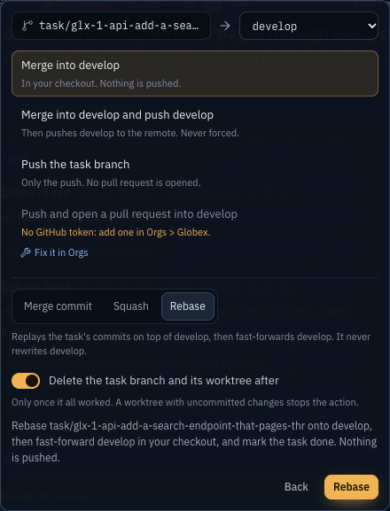
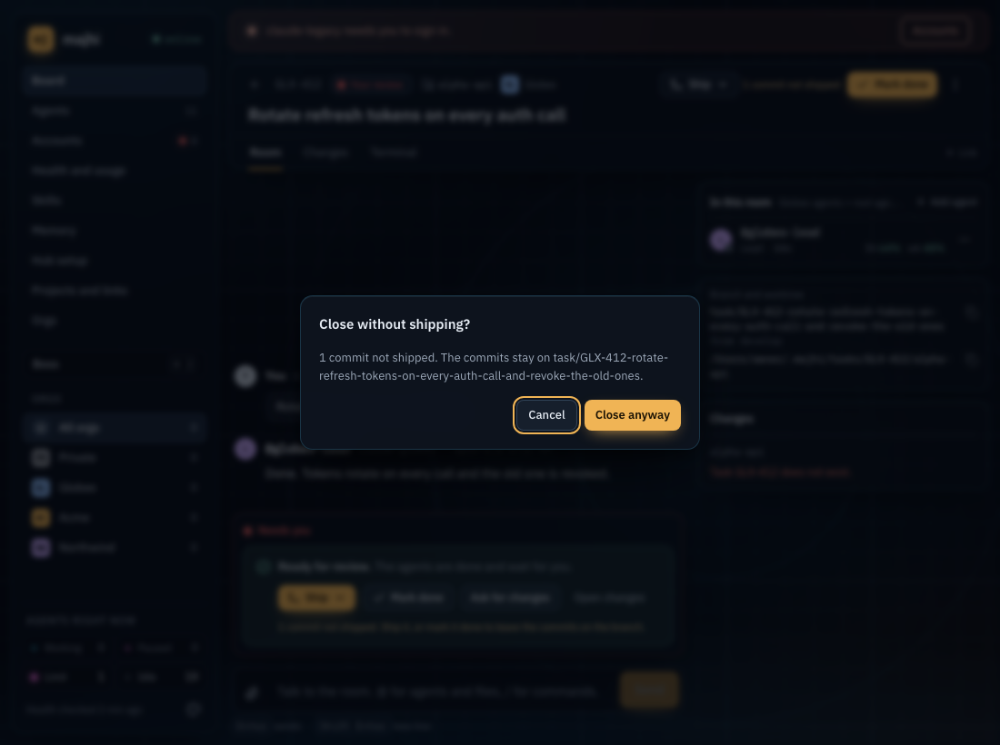
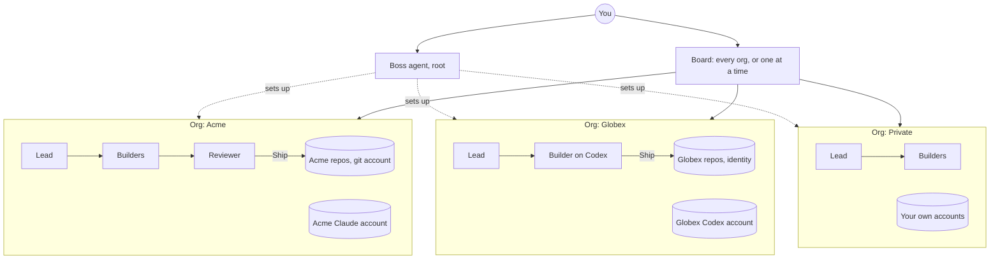

<div align="center">

# majhi

**Mission control for AI coding agents, across every client and project you work on.**

A crew of agents per client, sealed off from every other client, steered from one desk on your own machine.

[What it does](#what-you-do-with-majhi) ·
[A look inside](#a-look-inside) ·
[What works today](#what-works-today) ·
[Run it](#run-it) ·
[How it fits together](#how-it-fits-together) ·
[License](#license)

[](LICENSE)


<sub><em>Four clients, one board. Every agent, what it is doing, and how much of its account's limit is left.</em></sub>

</div>

---

*Majhi* (মাঝি) is the boatman who steers while others row. That is the job: you steer, the agents row.

If you freelance, consult, or run a day job next to side projects, you know the mess: three Claude subscriptions, two GitHub identities, an SSH key per client, a Codex account for one team, and the quiet fear of committing a client's code with the wrong email or letting one project's secrets slip into another's prompt.

Most agent tools give you one agent in one terminal. majhi gives you a team per client, fenced off from every other client, and a boss agent that runs the whole desk. It runs on your machine, in Docker, and nothing leaves it without your click.

**majhi builds itself.** Phases 3, 4 and 5 of this repo (teams, merge requests, memory) were planned, split, built, reviewed and merged by agent teams running inside majhi.

## What you do with majhi

- **Hand a task to a team in one sentence.** "Fix the export timeout in alpha-api from develop." The lead reads the code, writes a plan, splits it into subtasks, starts each one only when it will not collide with work already running, and hands you one card when it is done.
- **Switch clients without switching anything.** Each client is an org with its own AI accounts, agents, repos, git identity, tokens, secrets, board and memory. A Globex agent never sees an Acme repo, key or prompt.
- **Ship from the card.** Pick source and target branch, merge, squash or rebase, push, or open linked PRs and MRs on GitHub, GitLab and Bitbucket. Conflicts? One click on **Resolve and merge**: the lead fixes them and majhi finishes the merge.
- **Run the whole desk by talking to it.** Press Cmd+J and tell the boss "add Globex as a client with this Claude account, a lead and two builders, and register their repos." It does, through the same commands the UI uses, and asks before anything you would want to check.
- **Leave it running.** Laptop sleeps, Wi-Fi drops, the API is overloaded, an account hits its 5-hour limit: work pauses and resumes on its own from the last checkpoint.
- **Never lose work by accident.** A task with commits that are not merged, pushed or in a PR cannot be closed by an agent, and closing it yourself asks first.

## A look inside

<table>
  <tr>
    <td width="50%" valign="top">
      <br>
      <sub><strong>Every task is a room.</strong> The plan, the team, each tool call and the branch it works on, live.</sub>
    </td>
    <td width="50%" valign="top">
      <br>
      <sub><strong>Ship like you would in git.</strong> Source to target, merge, squash or rebase, and clean up after.</sub>
    </td>
  </tr>
  <tr>
    <td width="50%" valign="top">
      <br>
      <sub><strong>Limits belong to accounts.</strong> See every account's 5-hour and weekly meter before an agent hits it.</sub>
    </td>
    <td width="50%" valign="top">
      <br>
      <sub><strong>One org per client.</strong> Accounts, agents, repos, identity and policy, kept apart.</sub>
    </td>
  </tr>
  <tr>
    <td width="50%" valign="top">
      <br>
      <sub><strong>One box to start work.</strong> Pick the project, or let majhi read it from what you typed.</sub>
    </td>
    <td width="50%" valign="top">
      <br>
      <sub><strong>No silent losses.</strong> Unshipped commits are counted before anything closes.</sub>
    </td>
  </tr>
</table>

## Why majhi

### Every client in its own sealed workspace
Work lives in **orgs**: one per client, per team, per side project, plus **Private** for your own. Each org owns its:

- **AI accounts.** The client's Claude or Codex subscription, or API keys, used only for that client's work. Several agents can share one account and its meter.
- **Agents.** A lead, builders and reviewers, each with its own model, instructions, permissions and fallbacks.
- **Git accounts.** Pick "GitLab: acme-dev" for Acme once. Every Acme repo then pushes with that key, commits with that identity, and opens MRs with that token.
- **Secrets.** Encrypted with [age](https://age-encryption.org), scoped to the org, handed only to that org's runs.
- **Board, task keys, policy, usage and memory.** `GLX-12` is a Globex task, `ACM-7` an Acme one. Costs add up per org. Facts learned on one client's code are recalled only for that client.

Under that sits hard isolation: every agent run gets its own container that mounts **only its task's worktree and its own account home**. Not your other repos, not `~/.majhi`, not the secrets key, not another client's anything. The Health page proves it by trying.

### Your logins, without the setup
majhi finds what your Mac already has: your `gh` and `glab` logins, your SSH keys and `~/.ssh/config` aliases, and the git logins saved in your Keychain. It tests which account each one reaches, pushes with the right one for each repo (https remotes too), and offers "Use this login for Acme?" as one click. Tokens never reach an agent.

### A team, not a chatbot
- **Lead, builders, reviewer, tester.** Agents hand work to each other with `@mentions`. Pick how they take turns: the lead delegates, a fixed pipeline, or a build and review loop that runs until the reviewer says APPROVED.
- **The lead plans like an engineer.** It splits big tasks, draws dependencies, and checks which files each subtask touches and which accounts have budget before it starts anything.
- **Loop guard.** Agents that talk in circles without changing a file get paused. Agents doing real work never do.

### It gets smarter, locally
- **An on-device decision model.** [Laya](https://github.com/NandhaKishorM/laya) runs locally (MLX on Apple silicon) and makes the small calls that should not cost a frontier model: how big a task is, which model and effort fit, whether a review approved. It only acts when it clearly beats chance, and you can mark any pick wrong.
- **Memory.** When a task finishes, lasting facts are extracted, deduplicated with local embeddings, curated, and recalled into the next task on that repo.
- **Search across every room.** Messages, handoffs and tool output, indexed on your machine.
- **Tokens and cost.** Every turn is recorded by org, project, agent, account and model.

### You stay in charge
- **One "Needs you" dock.** Approvals, questions, reviews and paused tasks pin above the message box.
- **Every outbound step asks first.** Pushes, PRs and merges into shared branches wait for your click, unless an org's policy says otherwise.
- **Every config change is a commit.** `~/.majhi` is a git repo, so anything the boss or you change can be undone.

## Three short stories

**Monday, three clients.** You open the board. Acme's lead finished the SSO fix overnight and it waits in Needs you with a green review. Globex's builder is paused: its Claude account hit the 5-hour limit and resumes at 1:30 on its own. You click Ship on the Acme card, Merge and push, and move on.

**A conflict, handled.** You click Merge into main and get "Nothing was merged. Conflicts in search.ts." You click **Resolve and merge into main**. The lead merges main into its branch, keeps both sides, reruns the checks, and majhi finishes the merge you asked for. You never typed a word.

**A new client in one message.** "Add Northwind with this Codex account, a lead on high effort and one builder, and register their infra repo." The boss drafts it, you approve one card, and the first Northwind task can start a minute later.

## What works today

| Works today | Being built | Not yet |
|---|---|---|
| Orgs with sealed accounts, agents, repos, identity, secrets and memory | Full end-to-end tests run on main in the background after each merge | Agents beyond Claude Code and Codex (the agent list is a registry, so more can be added) |
| A container per agent run | Task pages on narrow screens | |
| Boss agent with approval cards and undo | | |
| Lead, builders, reviewers; planning, subtasks, dependencies | | |
| Ship panel: merge, squash, rebase, push, PRs and MRs, Resolve and merge | | |
| Detected gh, glab, SSH and Keychain logins; git accounts per org | | |
| Resume after sleep, network loss, overload and usage limits | | |
| Local decision model, memory, room search, tokens and cost | | |
| Scheduled and watch-triggered tasks | | |
| One-click updates that go back to the previous version if the new one fails | | |

## Run it

Needs Docker (OrbStack or Docker Desktop).

```sh
make up       # build, mount your workspace roots, start on http://127.0.0.1:7070
make doctor   # check config, mounts, git, SSH agent and disk space
```

After that, updates are one click in the sidebar. Config lives in `~/.majhi` (`majhi.yaml`).

## How it fits together



Each box is sealed: its agents run in their own containers with only their own task, account and credentials. Agents speak the [Agent Client Protocol](https://agentclientprotocol.com) (Claude Code and Codex today). A Hono server, SQLite and a React app run in one Docker compose file, plus a small host helper for what a container cannot do: mounting folders, SSH and Keychain logins, opening your editor, and updates.

## Develop

Needs Node 22 and pnpm 11.

```sh
pnpm install
pnpm dev          # server on 127.0.0.1:7070, web on the Vite dev server
pnpm e2e:smoke    # four key flows in about 20 seconds
make ci           # Biome, typecheck, tests, builds, full Playwright suite
```

TypeScript end to end, zod at every boundary, and a fake ACP agent so tests never spend tokens.

- [`SPEC.md`](SPEC.md): the design and the phased plan
- [`DESIGN.md`](DESIGN.md): the visual system
- [`docs/PROGRESS.md`](docs/PROGRESS.md) and [`docs/DECISIONS.md`](docs/DECISIONS.md): what is built, and why each call was made
- [`AGENTS.md`](AGENTS.md): how agents work on this repo (majhi's own agents read it too)

## What it is not

- **Not a cloud service.** No account with us, no server of ours. majhi itself sends nothing anywhere unless you turn on a hosted option; the agents talk only to their own providers, with the accounts you gave them.
- **Not an autopilot.** Agents do the rowing. Pushes, merges into shared branches and anything outbound wait for you.
- **Not one more chat window.** It is the desk the chat windows were missing: who works for which client, with which account, on which branch, and what is waiting for you.

## License

[PolyForm Noncommercial 1.0.0](LICENSE). Contact [@ashik112](https://github.com/ashik112).
