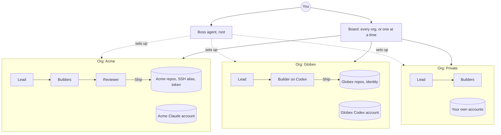

<div align="center">

# majhi

**Mission control for AI coding agents, across every client and project you work on.**

One desk for all your work. Each client, each side project, each team gets its own walled-off workspace with its own agents, accounts, repos and keys. Give a team of agents a task in one sentence; they plan it, build it, review it, and hand you one card: Ship.

[](LICENSE)


</div>

---

*Majhi* (মাঝি) is the boatman who steers the boat while others row. That is the job: you steer, the agents row.

If you freelance, consult, or juggle a day job and side projects, you know the mess: three Claude subscriptions, two GitHub identities, SSH keys per client, a Codex account for one team, and the constant fear of committing a client's code with the wrong email or letting one project's secrets leak into another's prompt.

majhi fixes that at the root. Most agent tools give you one agent in one terminal; majhi gives you a crew per client, fenced off from every other client, and a boss agent that runs the whole desk. It runs on your machine, in Docker, and nothing leaves it without your click.

**majhi builds itself.** Phases 3, 4 and 5 of this repo (teams, merge requests, memory) were planned, split, built, reviewed and merged by agent teams running inside majhi.

## What it does

### Every client in its own sealed workspace
Work lives in **orgs**: one per client, per team, per side project, plus **Private** for your own. Each org owns its:

- **AI accounts.** The client's Claude or Codex subscription, or API keys, used only for that client's work. Several agents can share one account.
- **Agents.** A lead, builders and reviewers with their own models, instructions, permissions and fallbacks. An org's agent can never be put on another org's task unless you name that org for it.
- **Repos and git identity.** Commits carry that client's name and email. Pushes go through that client's SSH host alias, and PRs and MRs use that client's GitHub, GitLab or Bitbucket token.
- **Secrets and credentials.** Encrypted with [age](https://age-encryption.org), scoped to the org, handed only to that org's runs. An agent process never gets majhi's own environment or another org's credentials.
- **Merge policy, board, task keys, usage and memory.** `GLX-12` is a Globex task, `ACM-7` an Acme one. Costs add up per org. Facts learned on one client's code are recalled only for that client.

Under that sits hard isolation: every agent run gets its own container that mounts **only its task's worktree and its own account home**. Not your other repos, not `~/.majhi`, not the secrets key, not another client's anything. majhi's Health page proves it by trying.

### A boss for the whole desk
Above the orgs sit **root agents**, led by **the boss** (Cmd+J). Tell it "add Globex as a client with this Claude account, a lead and two builders, and register their api and web repos" and it does, through the same typed commands the UI uses. Destructive and outbound steps come to you as one-click approval cards. Every change is a git commit in `~/.majhi`, so any of it can be undone. Root agents can also be allowed to work across chosen orgs, for the jobs that span them.

### A team, not a chatbot
- **Lead, builders, reviewer, tester.** Agents hand work to each other with `@mentions`. Pick how they coordinate: the lead delegates, a fixed pipeline, or a build and review loop that runs until the reviewer says APPROVED.
- **The lead plans like an engineer.** It splits a big task into subtasks, draws dependencies, and starts each one only when it will not collide with work already running (it compares the files each task touches) and when an account has budget left.
- **Loop guard.** Agents that talk in circles without changing a file get paused. Agents doing real work never do.

### Built to run all day
- **Every agent in its own container.** A run sees its task folder and its account, never your other repos, your config or your secrets. Secrets are encrypted with [age](https://age-encryption.org).
- **Context that does not balloon.** Sessions compact before they hit the wall, with a handoff note, and rotate when they get long.
- **Picks up where it left off.** Laptop sleeps, Wi-Fi drops, the API says 529 Overloaded, majhi restarts: turns resume on their own from the last checkpoint.
- **Background processes.** Test suites and dev servers run in the background; the agent is woken when they finish.

### You stay in charge
- **One "Needs you" dock.** Approvals, questions, reviews and paused tasks pin above the message box, so nothing gets buried under agent chatter.
- **Ship from the card.** Merge into main, dev or any branch. Merge and push. Open linked PRs and MRs on GitHub, GitLab and Bitbucket, in dependency order. Every outbound step asks first.

### It gets smarter, locally
- **An on-device decision model.** [Laya](https://github.com/NandhaKishorM/laya) runs locally (MLX on Apple silicon) and makes the small calls that should not cost a frontier model: how big a task is, which model and effort fit, whether a review approved. It only acts when it clearly beats chance, and you can mark any pick wrong.
- **Memory.** When a task finishes, lasting facts are extracted, deduplicated with local embeddings, curated, and recalled into the next task on that repo. Facts can be promoted into the repo's `AGENTS.md`.
- **Tokens and cost.** Every turn is recorded, by org, project, agent, account and model, next to each account's 5-hour and weekly limits.

## How it fits together



Each box is sealed: its agents run in their own containers with only their own task, account and credentials. The lead inside each org plans and splits the work, a local decision model ([Laya](https://github.com/NandhaKishorM/laya)) makes the small calls, and memory stays inside the org it came from.

Under the hood: agents speak the [Agent Client Protocol](https://agentclientprotocol.com) (Claude Code and Codex today), each in its own runner container. A Hono server, SQLite and a React app, all in one Docker compose file, plus a small host helper for the things a container cannot do (mounting folders, SSH keys, updates).

## Run it

Needs Docker (OrbStack or Docker Desktop).

```sh
make up       # build, mount your workspace roots, start on http://127.0.0.1:7070
make doctor   # check config, mounts, git, SSH agent and disk space
make logs
make down
```

After that, updates are one click in the sidebar. Config lives in `~/.majhi` (`majhi.yaml`), and it is a git repo: every change majhi makes is a commit you can undo.

## Develop

Needs Node 22 and pnpm 11.

```sh
pnpm install
pnpm dev      # server on 127.0.0.1:7070, web on the Vite dev server
make ci       # Biome, typecheck, tests, builds, Playwright
```

TypeScript end to end, zod at every boundary, and a fake ACP agent so tests never spend tokens.

## Where things are

- [`SPEC.md`](SPEC.md): the design and the phased plan
- [`docs/PROGRESS.md`](docs/PROGRESS.md) and [`docs/DECISIONS.md`](docs/DECISIONS.md): what is built, and why each call was made
- [`AGENTS.md`](AGENTS.md): how agents work on this repo (majhi's own agents read it too)

## License

[PolyForm Noncommercial 1.0.0](LICENSE).

- Free for personal use: learning, hobby projects, your own side projects that earn nothing.
- Commercial use needs a paid license. That includes freelance and client work, use at a company, and selling or hosting majhi. Contact [@ashik112](https://github.com/ashik112).
