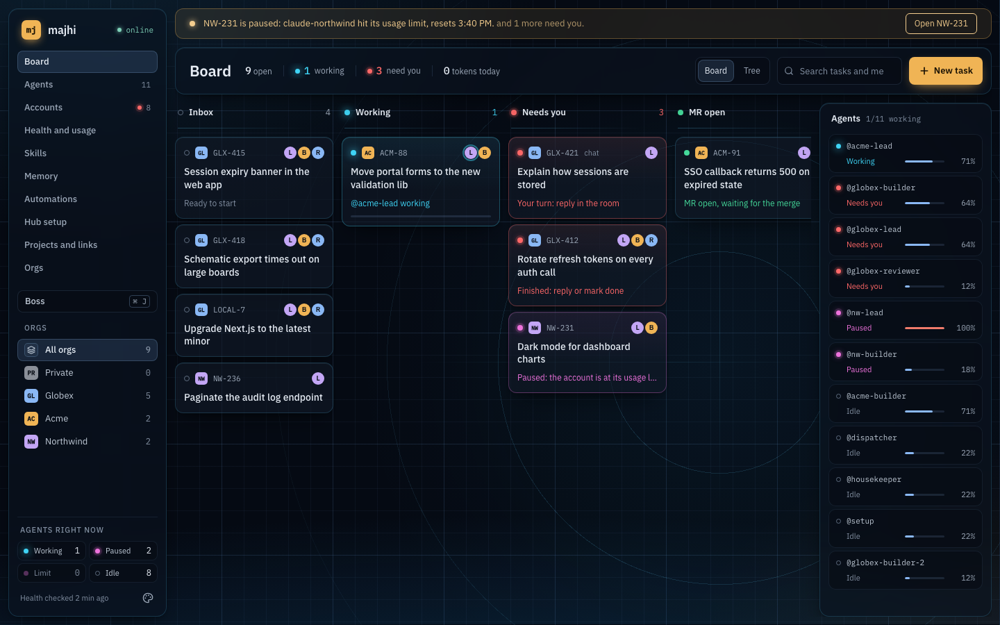
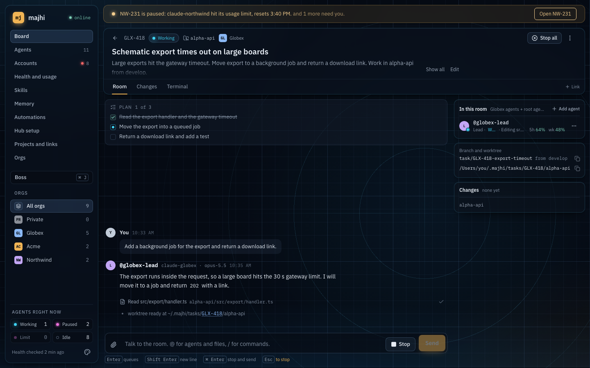
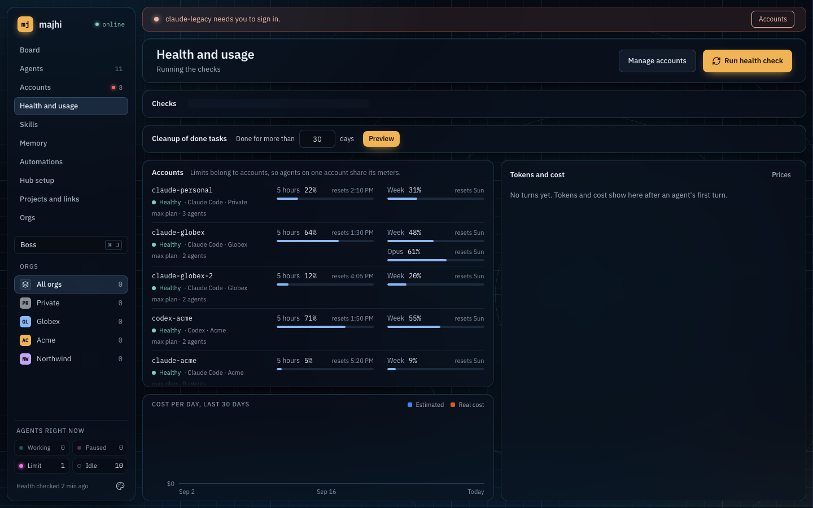
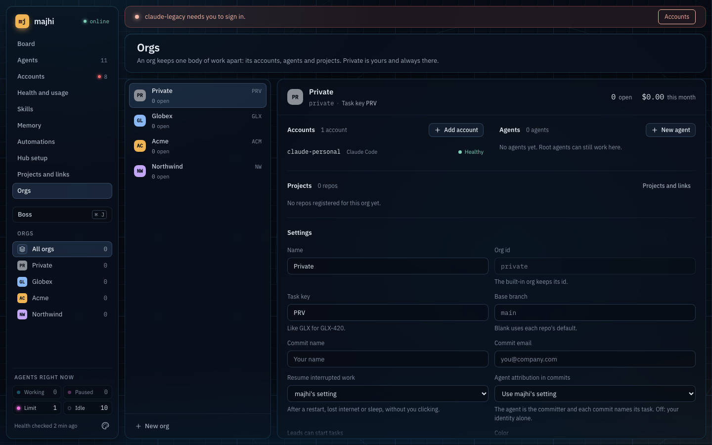
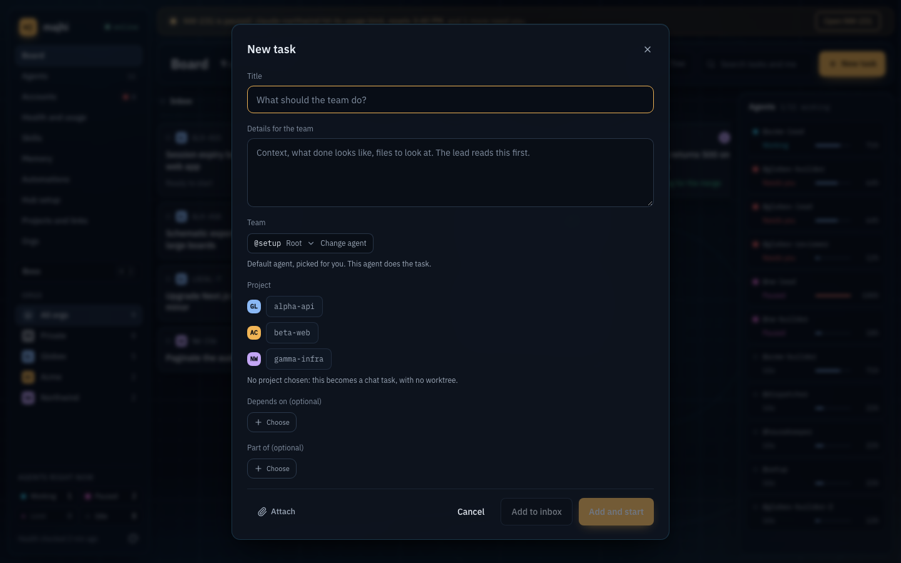
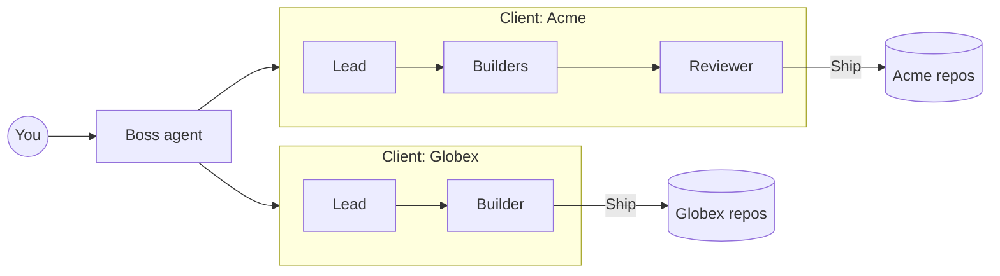

<div align="center">

# majhi

### Run a team of AI coding agents for every client, from one desk.

Give a task in one sentence. A team of agents plans it, builds it, reviews it, and hands you one card to ship. Each client gets its own agents, accounts, repos and keys, kept fully apart.

[](LICENSE)




</div>

---

*Majhi* (মাঝি) is the boatman who steers while others row. You steer. The agents row.

## Why it exists

AI agents can now write real code. Running them for real work is still a mess: one subscription per client, a different GitHub or GitLab login for each, SSH keys, tokens, and the constant risk of one client's code or secrets ending up in another client's work. Most tools give you one agent in one terminal and leave the rest to you.

majhi turns that into a desk you can run all day:

- **More work shipped, less babysitting.** Agents work in teams, resume on their own after sleep, network drops or usage limits, and only stop for you when a decision is really yours.
- **Clients never mix.** Every client is its own sealed workspace: its AI accounts, agents, repos, git identity, tokens, costs and memory. Every agent runs in its own container and sees only its own task.
- **You stay in control.** Nothing is pushed, merged or sent out without your click, unless you allow it for that client.

## What you can do

| | |
|---|---|
| **Hand off work in one sentence** | "Fix the export timeout in the API, from develop." The lead agent plans, splits the work, assigns builders and a reviewer, and reports back. Not every task needs code: start a plain chat, or an investigation that ends in a report. |
| **Let it run the desk** | Turn on autonomous mode and the boss works through your backlog like you would: it picks tasks by priority and due date, sets up teams, starts and ships work. It stays inside the daily budget, each client's cap and the account limits you set. It approves routine steps for you, but never force-pushes or moves one client's secrets to another. Pushes and merges stay off for each client until you allow them. Every decision is logged with its reason. Watch it live, guide it, pause or stop it at any time, and read a summary each day. |
| **Ship from one card** | Merge, squash or rebase into any branch, push, or open pull and merge requests on GitHub, GitLab and Bitbucket. Conflicts get fixed with one click. |
| **Watch and steer live** | See the plan, every step and every file change as it happens. Stop a turn, queue a message, open a terminal, or open any file in VS Code or Cursor. Comment on lines of a diff and send them back as one review. |
| **Work across repos** | One task can span several repos, with linked pull requests merged in the right order. Big tasks split into subtasks that wait for each other. |
| **Previews and services** | Agents build and run your app and its databases in their own containers, so you can open a live preview of each task. |
| **Automate the routine** | Schedules like "weekdays at 9:00" and triggers that react to what happens, to start tasks or wake agents without you. |
| **Checks after every merge** | After a merge into main, majhi runs the whole e2e suite by itself, at low priority, so nobody waits on it. The result shows on Health and in the room of the task that merged. A break opens one task with the failing specs and the traces. |
| **It learns your codebase** | Lasting facts from each task are kept per repo and recalled in the next one, so agents stop relearning the same things. |
| **Run everything by asking** | The boss agent sets up clients, accounts, agents and repos when you describe them, and asks before anything risky. |
| **Use the logins you already have** | majhi finds your GitHub, GitLab and Bitbucket logins and SSH keys on your Mac and uses the right one per client. |
| **Spend less on every task** | [Laya](https://github.com/NandhaKishorM/laya), a small model running free on your Mac's GPU, makes the many small calls: which model and effort a task needs, which client and team it belongs to, whether a memory is new. Big models only get the work that needs them. |
| **Know what it costs** | Tokens, cost and each account's usage limits, per client, project and agent. Long sessions compact before they fill up, so costs do not climb. |
| **Never lose work** | Unshipped commits are counted before any task can close. Updates roll back on their own if something breaks. |

## Smart where it counts, cheap everywhere else

Most of an agent desk's decisions are small: is this task big or small, which model fits, which team should take it, did the reviewer approve, is this text trying to give the agent orders. Paying a frontier model for each of those adds up.

majhi hands them to **Laya**, an open model that runs on your machine (natively on Apple silicon). It is free, private and fast, and it only acts when its answer clearly beats a guess. Otherwise majhi falls back to simple rules. Every agent can also ask it quick yes/no and pick-one questions instead of spending its own tokens. You can mark any wrong pick, and the cost view shows what it saved.

## A look inside

<table>
  <tr>
    <td width="50%"></td>
    <td width="50%"></td>
  </tr>
  <tr>
    <td align="center"><sub><b>Every task is a room.</b> Plan, team, progress and branch, live.</sub></td>
    <td align="center"><sub><b>Limits per account.</b> See them before an agent hits them.</sub></td>
  </tr>
  <tr>
    <td width="50%"></td>
    <td width="50%"></td>
  </tr>
  <tr>
    <td align="center"><sub><b>One workspace per client.</b> Accounts, agents, repos and rules.</sub></td>
    <td align="center"><sub><b>One box to start work.</b> Pick the project and the team.</sub></td>
  </tr>
</table>

## Install

You need Docker (Docker Desktop or OrbStack) on a Mac.

```sh
git clone https://github.com/ashik112/majhi.git && cd majhi
make up    # opens on http://127.0.0.1:7070
```

The first screen walks you through your folders, your first AI account and the boss agent. After that, updates are one click.

## How it works



Each client is sealed off: its agents run in their own containers with only their own task, account and credentials. majhi runs on your machine. Agents use Claude Code and Codex with the accounts you connect.

<details>
<summary><b>For developers</b></summary>

majhi is TypeScript end to end: a Hono server, SQLite and a React app in one Docker compose file, plus a small helper on the Mac for logins, folders and updates. Agents speak the [Agent Client Protocol](https://agentclientprotocol.com).

```sh
pnpm install
pnpm dev          # server and web app
pnpm e2e:smoke    # quick end-to-end check
make ci           # everything CI runs
```

- [`SPEC.md`](SPEC.md): design and plan
- [`DESIGN.md`](DESIGN.md): visual system
- [`docs/PROGRESS.md`](docs/PROGRESS.md) and [`docs/DECISIONS.md`](docs/DECISIONS.md): what is built and why
- [`AGENTS.md`](AGENTS.md): how agents work on this repo

Much of majhi was planned, built, reviewed and merged by agent teams running inside majhi.

</details>

## License

[PolyForm Noncommercial 1.0.0](LICENSE). Commercial licenses: [@ashik112](https://github.com/ashik112).
