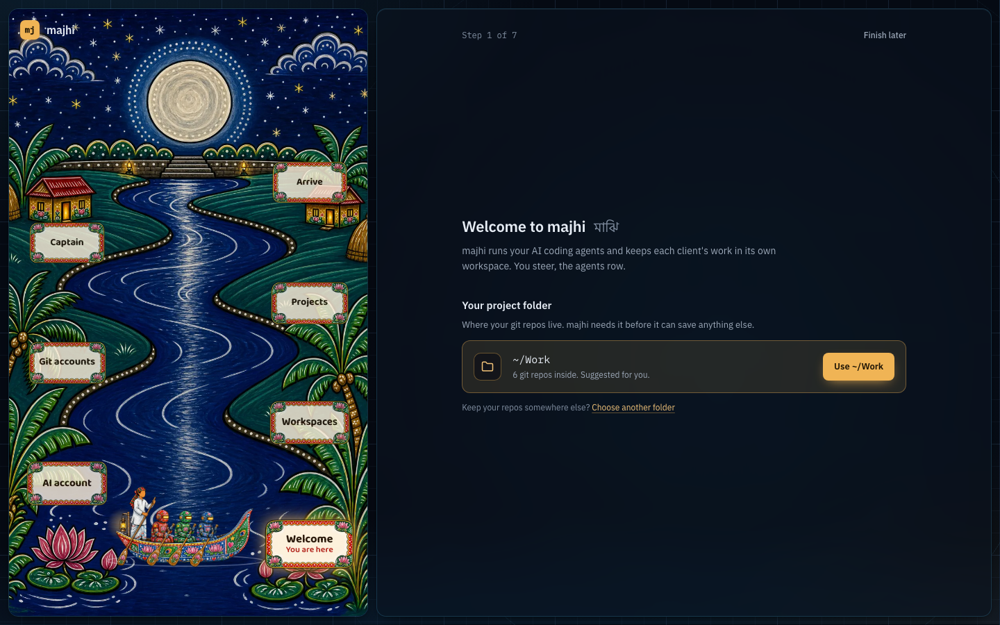
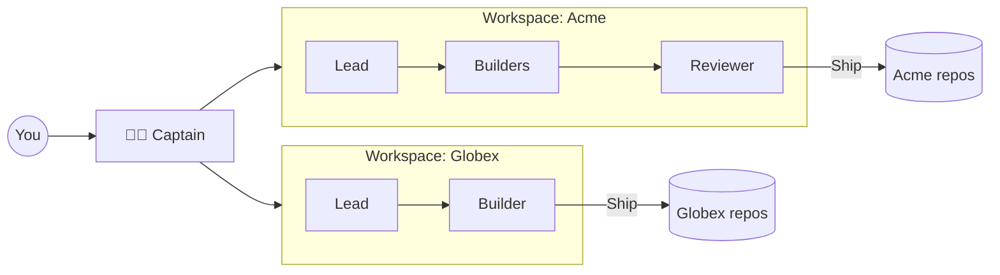

<div align="center">

<picture>
  <source media="(prefers-color-scheme: dark)" srcset="docs/assets/majhi-mark-saffron.svg">
  
</picture>

# majhi <sub><sup>মাঝি</sup></sub>

### You steer. The agents row.

**A desk for running crews of AI coding agents, one crew per client, from a single screen.**<br>
Say what you want in one sentence. A lead plans it, builders write it, a reviewer checks it,<br>and you get one card to ship. Every client's code, keys and accounts stay in their own boat.

[](LICENSE)




</div>

---

On the rivers of Bengal, the *majhi* stands at the back of the boat with the long oar. He does not row. He reads the water, picks the line, and keeps everyone pointed at the ghat.

That is the job majhi gives you. AI agents can write real code now, but running them for real work is chaos: a subscription per client, a different git login for each, keys everywhere, and the quiet fear that one client's code ends up in another's repo. majhi turns that into a calm desk. You decide where the boat goes. The crew does the rowing.

## Meet the crew

| | Who | What they do |
|:-:|---|---|
| 🧑‍✈️ | **The captain** | Your second in command. Sets up clients, accounts, agents and repos when you describe them. Answers the crew's questions. With autonomous mode on, runs the whole desk while you sleep. |
| 👑 | **The lead** | Reads your one sentence, writes the plan, splits the work and hands each piece to the right agent. |
| 🛠️ | **Builders** | Write the code in their own worktree and container, test it, and commit. |
| 🔍 | **The reviewer** | Reads every change before it reaches you, and sends it back when it is not good enough. |

Every agent gets its own emoji, model and account. Mix Claude Code and Codex in one team.

## What it does

### ⛵ Hand it off in one sentence
"Fix the export timeout in the API, from develop." That is a whole task. The lead plans, the crew builds and reviews, and you get a report and a branch. Not everything needs code: open a plain chat, or an investigation that ends in a written answer. Big work splits into subtasks that wait for each other, across as many repos as it needs.

### 🌙 Let it sail through the night
Flip on **autonomous mode** and the captain works your backlog like you would. It picks tasks by priority and due date, forms teams, starts work and ships it. It stays inside a daily budget, each client's cap and the account limits you set, and you choose how big a task it may take and which clients it may touch. Every decision lands in a log with its reason. In the morning there is a summary waiting.

### 🧳 Every client in its own boat
Each client is a sealed **workspace**: its own AI accounts, agents, repos, git identity, tokens, costs and memory. Agents run in containers and see only their own task. They never get your SSH keys, majhi's own secrets, or another client's anything. Pushes and merges happen only through majhi, after your click, unless you allow them for that client.

### 🚢 Ship from one card
Merge, squash or rebase into any branch. Push, or open pull and merge requests on GitHub, GitLab and Bitbucket. Several repos ship together or not at all, and linked requests merge in the right order. A conflict is one click to fix. Infra repos can be marked protected so nothing lands there by accident.

### 👀 Watch the water
See the plan, every step and every file change as it happens. Stop a turn, queue a message for later, open a terminal, or jump into any file in VS Code or Cursor. Comment on lines of a diff and send it all back as one review. Agents build and run your app in their own containers, so every task gets a **live preview**.

### 🔔 It only calls you when it matters
One bell collects everything that needs you: approvals, questions, decisions, blocked tasks, accounts that need a sign-in. Everything else is handled. You set what needs your click on one page, by kind of work, with presets from careful to hands-off.

### 🧠 It remembers your codebase
Lasting facts from each task are kept per repo and brought back in the next one, so agents stop relearning the same quirks. A housekeeper keeps that memory tidy.

### ⏰ It runs on a schedule
"Weekdays at 9:00" or "when a task reaches review": schedules and triggers start tasks or wake agents without you. After every merge into main, majhi runs the full end-to-end suite in the background and opens one task when something breaks.

### 🛟 It does not sink
Laptop asleep, Wi-Fi gone, usage limit hit, a model refusing a request? Agents pause, resume on their own and pick up where they stopped. A teammate that finishes quietly wakes the lead, so tasks never sit silent. Unshipped commits are counted before anything can close, and updates roll back by themselves if they break.

### 🔑 Bring your own logins
majhi finds the GitHub, GitLab and Bitbucket logins and SSH keys already on your computer and uses the right one for each client. Clone repos from your accounts, or start a brand new project, straight from the setup journey.

## Smart where it counts, cheap everywhere else

An agent desk makes hundreds of small calls a day. Is this task big or small? Which model fits? Which team should take it? Did the reviewer approve? Is this text in a repo trying to give the agent orders? Paying a frontier model for each of those adds up fast.

majhi hands them to **[Laya](https://github.com/NandhaKishorM/laya)**, a small open model that runs on your own machine (natively on Apple silicon). It is free, private and quick, and it only acts when its answer clearly beats a guess; otherwise plain rules decide. Agents can ask it quick yes or no questions instead of spending their own tokens, and the cost view shows what it saved. The big models only get the work that needs them.

And you always know the bill: tokens, cost and every account's usage window, per client, project and agent. Long sessions compact before they fill up, so costs do not creep.

## A look inside


<table>
  <tr>
    <td width="50%"></td>
    <td width="50%"></td>
  </tr>
  <tr>
    <td align="center"><sub><b>Every task is a room.</b> Plan, crew, progress and branch, live.</sub></td>
    <td align="center"><sub><b>Limits per account.</b> See them before an agent hits them.</sub></td>
  </tr>
  <tr>
    <td width="50%"></td>
    <td width="50%"></td>
  </tr>
  <tr>
    <td align="center"><sub><b>One workspace per client.</b> Accounts, agents, repos and rules.</sub></td>
    <td align="center"><sub><b>One box to start work.</b> Pick the project and the crew.</sub></td>
  </tr>
</table>

## Get on board

majhi runs on macOS, Linux and Windows through WSL2. With Docker running (see below for your OS), one line installs it:

```sh
curl -fsSL https://raw.githubusercontent.com/ashik112/majhi/main/install.sh | sh
```

It checks the computer first and stops with the step to take when something is missing. It keeps majhi in `~/.majhi/app` at the newest release, pulls that release's images (amd64 and arm64) instead of building them, starts majhi on http://127.0.0.1:7070 and opens it. After that, updates are one click in majhi, and running the line again is safe: it updates to the newest release too. `MAJHI_VERSION=v1.2.3` before `sh` installs that release instead.

**From source**, for working on majhi: `git clone https://github.com/ashik112/majhi.git && cd majhi && make up` builds every image from the checkout. It runs the same steps as the installer (`scripts/up.sh`), and updates rebuild what is on disk.

### macOS

You need:

- OrbStack or Docker Desktop
- git and Node 20 or newer (`brew install git node`)

Then run the install line above.

At login, the host helper (the LaunchAgent `dev.majhi.host`) opens OrbStack or Docker Desktop when it is not running, then starts majhi. On Apple silicon it also runs Laya on the Mac's GPU.

### Linux

You need:

- [Docker Engine](https://docs.docker.com/engine/install/) running as root, with the Compose plugin. Docker Desktop for Linux and rootless Docker are not supported yet.
- Your user in the `docker` group: `sudo usermod -aG docker $USER`, then log out and back in
- git and Node 20 or newer (and make, for the from-source path)
- systemd, which most distros run
- `secret-tool` (`libsecret-tools` on Debian and Ubuntu, `libsecret` on Fedora and Arch) and a keyring such as GNOME Keyring, which keeps a copy of majhi's secrets key. Without one, export the key on majhi's Health page and keep the file safe.
- `notify-send` (`libnotify-bin` on Debian and Ubuntu) for notifications

Then run the install line above.

At login, systemd starts two user units: the host helper (`majhi-host.service`), which starts majhi, and majhi's SSH agent (`majhi-ssh-agent.service`), used when your session has none. Docker Engine starts at boot once you run `sudo systemctl enable --now docker`.

With an NVIDIA GPU and the [NVIDIA Container Toolkit](https://docs.nvidia.com/datacenter/cloud-native/container-toolkit/latest/install-guide.html), the installer and `make up` give Laya the GPU. Its image is then a few GB bigger. `LAYA_GPU=off` (`curl ... | LAYA_GPU=off sh`, or `make up LAYA_GPU=off`) keeps it on the CPU, and `.env.example` says what an older GPU needs.

### Windows (WSL2)

You need:

- WSL2 with a Linux distro: `wsl --install` in PowerShell sets up Ubuntu
- Docker Desktop, set to start when you sign in (Settings > General), with WSL integration on for the distro (Settings > Resources > WSL integration)
- systemd in the distro. Ubuntu from `wsl --install` has it. Otherwise add `systemd=true` under `[boot]` in `/etc/wsl.conf`, then run `wsl --shutdown` in Windows.
- git and Node 20 or newer in the distro (and make, for the from-source path)

Run the line in the distro's terminal. Keep your repos in the distro (for example under `~/code`), not under `/mnt/c`, which is much slower to reach from Linux.

Then run the install line above.

At sign-in, Docker Desktop starts the distro, and systemd starts the host helper and majhi's SSH agent there, as on Linux. The installer turns on lingering for your user so they run with no terminal open, or prints the `sudo loginctl enable-linger` line to run. WSL2 usually has no keyring, so export the secrets key on majhi's Health page and keep the file safe. With an NVIDIA driver in Windows, Laya gets the GPU, as on Linux.

The river journey walks you through your project folder, your first AI account, your clients, their git logins, your repos and the captain. After that, updates are one click.

## How it works



Everything runs on your machine. Each workspace is sealed off: its agents run in their own containers with only their own task, account and credentials. Agents are Claude Code and Codex, signed in with the accounts you connect.

<details>
<summary><b>For developers</b></summary>

majhi is TypeScript end to end: a Hono server, SQLite and a React app in one Docker compose file, plus a small helper on your computer for logins, folders and updates. Agents speak the [Agent Client Protocol](https://agentclientprotocol.com).

```sh
pnpm install
pnpm dev          # server and web app
pnpm e2e:smoke    # quick end-to-end check
make ci           # everything CI runs
```

- [`SPEC.md`](SPEC.md): design and plan
- [`DESIGN.md`](DESIGN.md): visual system
- [`docs/PROGRESS.md`](docs/PROGRESS.md) and [`docs/DECISIONS.md`](docs/DECISIONS.md): what is built and why
- [`AGENTS.md`](AGENTS.md): how agents work on this repo

Much of majhi was planned, built, reviewed and merged by agent crews running inside majhi.

</details>

## License

[PolyForm Noncommercial 1.0.0](LICENSE). Commercial licenses: [@ashik112](https://github.com/ashik112).
