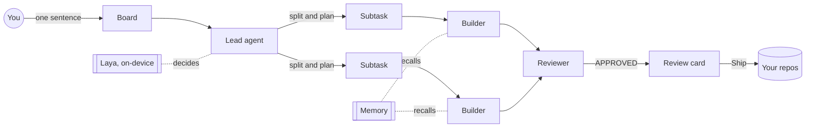

<div align="center">

# majhi

**Mission control for your AI coding agents.**

Give a team of agents a task in one sentence. They plan it, split it, build it in isolated worktrees, review each other, and hand you one card: Ship.

[](LICENSE)


</div>

---

*Majhi* (মাঝি) is the boatman who steers the boat while others row. That is the job: you steer, the agents row.

Most agent tools give you one agent in one terminal. majhi gives you a crew. A lead plans, builders write, a reviewer pushes back, and majhi keeps them from stepping on each other, running out of budget, or pushing anything you did not approve. It runs on your machine, in Docker, and nothing leaves it without your click.

**majhi builds itself.** Phases 3, 4 and 5 of this repo (teams, merge requests, memory) were planned, split, built, reviewed and merged by agent teams running inside majhi.

## What it does

### A team, not a chatbot
- **Lead, builders, reviewer, tester.** Agents hand work to each other with `@mentions`. Pick how they coordinate: the lead delegates, a fixed pipeline, or a build and review loop that runs until the reviewer says APPROVED.
- **The lead plans like an engineer.** It splits a big task into subtasks, draws dependencies, and starts each one only when it will not collide with work already running (it compares the files each task touches) and when an account has budget left.
- **Loop guard.** Agents that talk in circles without changing a file get paused. Agents doing real work never do.

### Built to run all day
- **Every agent in its own container.** A run sees its task folder and its account, never your other repos, your config or your secrets. Secrets are encrypted with [age](https://age-encryption.org).
- **Context that does not balloon.** Sessions compact before they hit the wall, with a handoff note, and rotate when they get long.
- **Picks up where it left off.** Laptop sleeps, Wi-Fi drops, the API says 529 Overloaded, majhi restarts: turns resume on their own from the last checkpoint.
- **Background processes.** Test suites and dev servers run in the background; the agent is woken when they finish.

### You stay in charge
- **One "Needs you" dock.** Approvals, questions, reviews and paused tasks pin above the message box, so nothing gets buried under agent chatter.
- **Ship from the card.** Merge into main, dev or any branch. Merge and push. Open linked PRs and MRs on GitHub, GitLab and Bitbucket, in dependency order. Every outbound step asks first.
- **A boss agent (Cmd+J).** Set up orgs, accounts, agents and repos by talking. Every change is a typed command, a git commit in `~/.majhi`, and can be undone.

### It gets smarter, locally
- **An on-device decision model.** [Laya](https://github.com/NandhaKishorM/laya) runs locally (MLX on Apple silicon) and makes the small calls that should not cost a frontier model: how big a task is, which model and effort fit, whether a review approved. It only acts when it clearly beats chance, and you can mark any pick wrong.
- **Memory.** When a task finishes, lasting facts are extracted, deduplicated with local embeddings, curated, and recalled into the next task on that repo. Facts can be promoted into the repo's `AGENTS.md`.
- **Tokens and cost.** Every turn is recorded, by org, project, agent, account and model, next to each account's 5-hour and weekly limits.

### Many clients, kept apart
Work lives in **orgs**: your own projects, each client, each team. Every org has its own accounts, agents, repos, git identity and credentials, and an agent from one never sees another.

## How it fits together



Under the hood: agents speak the [Agent Client Protocol](https://agentclientprotocol.com) (Claude Code and Codex today), each in its own runner container. A Hono server, SQLite and a React app, all in one Docker compose file, plus a small host helper for the things a container cannot do (mounting folders, SSH keys, updates).

## Run it

Needs Docker (OrbStack or Docker Desktop).

```sh
make up       # build, mount your workspace roots, start on http://127.0.0.1:7070
make doctor   # check config, mounts, git, SSH agent and disk space
make logs
make down
```

After that, updates are one click in the sidebar. Config lives in `~/.majhi` (`majhi.yaml`), and it is a git repo: every change majhi makes is a commit you can undo.

## Develop

Needs Node 22 and pnpm 11.

```sh
pnpm install
pnpm dev      # server on 127.0.0.1:7070, web on the Vite dev server
make ci       # Biome, typecheck, tests, builds, Playwright
```

TypeScript end to end, zod at every boundary, and a fake ACP agent so tests never spend tokens.

## Where things are

- [`SPEC.md`](SPEC.md): the design and the phased plan
- [`docs/PROGRESS.md`](docs/PROGRESS.md) and [`docs/DECISIONS.md`](docs/DECISIONS.md): what is built, and why each call was made
- [`AGENTS.md`](AGENTS.md): how agents work on this repo (majhi's own agents read it too)

## License

[PolyForm Noncommercial 1.0.0](LICENSE).
