# Wiki: architecture

Status: approved by the owner on 2026-10-06. Replaces the Map. Built from a trial on a real Django and Celery monorepo, two web research reports, a survey of majhi's own code, and a phase 0 bake-off of fact tools and page writers (results in section 13).

## 1. What it is

One wiki per workspace and one per project. It answers, in plain words and with a file:line behind every claim:

- where the frontend, backend, workers, queue, cache, database and sign-in are;
- where requests and jobs start, and how each main flow moves through the pieces, including across repos;
- what is guessed, what is proven, and what could not be worked out.

Two readers. The owner reads it in the app. Agents read it at the start of every task, so they spend less time grepping and make fewer wrong assumptions.

## 2. Rules the design follows

1. **Facts first, the LLM writes last.** Tools find facts with evidence. The LLM only names, groups facts it was given, and writes plain sentences. It cannot invent a component or a link. A checker drops any claim whose source does not hold.
2. **Reuse majhi, never rebuild.** Every part below names the existing code it reuses. New code is only where nothing exists.
3. **One switch.** Off means nothing runs, no tool is offered, no TASK.md section, no sidebar entry. Data stays, so turning it back on is instant.
4. **Pay only for what changed.** Fact tools run in seconds. The LLM rewrites only the pages whose sources changed.
5. **The workspace is the boundary.** A task never spans workspaces (`tasks/service.ts:435`), so neither does a wiki. Cross-repo flows live on the workspace wiki.

## 3. The pipeline

```mermaid
flowchart LR
  trig["Trigger<br/>base branch moved (ProjectCards)<br/>or Update button or playbook"]
  facts["1. Facts, per repo<br/>sealed reader container<br/>no network, no model"]
  sys["2. System facts, per workspace<br/>link repos by exact match"]
  plan["3. Plan pages<br/>which pages, which sources<br/>skip unchanged ones"]
  write["4. Write pages<br/>Housekeeper, cheapest model<br/>evidence bundle in, JSON out"]
  check["5. Check sources<br/>path, lines, hash at commit"]
  store[("6. Store<br/>wiki_pages in majhi.db<br/>search index in memory.db")]
  ui["Wiki page (owner)"]
  agents["Agents: TASK.md section<br/>+ wiki tool in majhi-memory"]

  trig -->|"one run per workspace at a time"| facts
  facts -->|"typed facts with file:line"| sys
  sys -->|"facts + links"| plan
  plan -->|"only pages whose sources changed"| write
  write -->|"draft pages with citations"| check
  check -->|"valid pages, bad claims dropped and listed"| store
  store -->|"read"| ui
  store -->|"read and search"| agents
```



### Step 1. Facts per repo (no model)

Runs in the existing sealed reader container: `GraphRunner` with `isolated` spawn (`map/graph/run.ts`, `acp/spawn.ts:28`): no network, read-only checkout, one writable cache folder, CPU and memory limits, env built from scratch. It moves from `map/graph/` to a shared `reader/` module, because both the wiki and `code_graph` use it.

| Fact | Tool | Evidence | Status |
|---|---|---|---|
| Deployable units, data stores, networks | `docker compose config --format json`, k8s and Terraform files parsed as data. Reuses the Map's scanners (`map/config/scan-*.ts`) | file:line | exists in majhi, moves |
| Stack and roles (Postgres, Redis, Celery, JWT, React) | Typed catalog: package or image name to role. Reuses `map/config/known.ts` (338 lines). specfy/stack-analyser as a second opinion | manifest line | exists, extend |
| Entry points: HTTP routes, queue consumers, cron, CLI, webhooks | Bake-off in phase 0: OWASP Noir (MIT, about 1 s per repo) against majhi's own `docker/map_inside.py` entries | file:line | decide in phase 0 |
| Code structure and symbols | graphify `graph.json` (already has file and line per symbol) | file:line | exists, keep |
| Components | Folder first, then names; graph communities only for leftovers. CodeBoarding measured folders at 0.94 against 0.34 for graph clustering | folder | new, small |
| Flow skeletons | From each entry point, walk the graph a few steps until a boundary (DB, queue, outside call, other repo). Raw material for flow pages, never shown as the overview | file:line per step | new, small |

What is **deleted**: `docker/map_resolve.py` and the call-resolution rules (DI wiring, handler tables, failure branches) that caused the endless patching.

### Step 2. System facts per workspace (no model)

Links repos only by exact matches, strongest first. Reuses the Map's resolver (`config/resolver.ts`, `ownerOfService`, `endpoints.ts`, owner answers in `MapResolution`):

1. Declared: shared OpenAPI or proto, a package one repo publishes and another imports, `projects.<id>.links` (depends-on) from majhi.yaml. The Map ignores these today; the wiki uses them.
2. Exact contract: an HTTP method plus path in a client call matched to a route in another repo; the same queue or topic name on both sides.
3. Config: an env var URL that points to a compose or k8s service name.
4. The owner's answer, asked in the UI when nothing above proves it.
5. A guess by the LLM: drawn dashed, labeled "guessed", never mixed with the above.

Calls that cannot be linked go on a "not linked" list with file:line. That list is useful by itself.

### Step 3. Plan pages

Every page records the source files it was written from. On a new commit, `git.changed(from, to)` (already used by `ProjectCards`) gives the changed files. Only pages that cite one of them are rewritten. Parent pages are rewritten only if a child's summary changed. A page whose facts did not change costs nothing.

### Step 4. Write pages (read-only agent, mid-tier model)

Chosen in phase 0 (section 12, item 5). A Housekeeper session in a new read-only mode: the repo's clean export at the pinned commit mounted read-only, a permission handler that allows reads and refuses everything else, no network beyond the model, per-workspace credentials, spend through `UsageRecorder`. The plumbing exists (`SessionStart.mounts`, `setPermissionHandler`); the mode does not. It gets the facts as hints and returns JSON pages with citations. Repo text is data, never instructions. A second pass on the cheapest model may only reword sentences into plain words; it cannot touch citations or status.

Fix on the way: spend is recorded with the workspace set, unlike the Map's `map:<org>` pseudo task, which leaves `org` empty and escapes workspace budgets (`usage/recorder.ts:92`).

### Step 5. Check sources

Each citation is `{repo, commit, path, startLine, endLine, hash}`. The checker confirms that the path exists at that commit, the lines are in range, the text still matches, and the file was in the bundle the model saw. A claim that fails is dropped and listed under "Could not confirm". When the code moves on, old citations show "may be out of date" until the page is rewritten.

### Step 6. Store

| What | Where | Why |
|---|---|---|
| Pages, versions, owner notes, owner answers | `majhi.db`, new tables from migration 171 (`wiki_pages`, `wiki_page_versions`) | Costs money to make and holds owner input, so it is backed up |
| Facts and caches | `<tasks_dir>/.wiki/<org>/<project>/`, same pattern as `.map/` | Rebuildable; the reader container can write there |
| Search | Wiki chunks in `memory.db` FTS5 plus vectors, through the existing `hybridSearch` and local embedder (`memory/search.ts`) | No second search engine |

## 4. Data model (in `packages/shared/src/wiki.ts`)

```ts
type Basis = "declared" | "exact" | "config" | "owner" | "guessed";
type Role = "frontend" | "backend" | "worker" | "queue" | "cache" | "database"
          | "auth" | "outside" | "library" | "infra" | "unknown";

interface Source { repo: ProjectId; commit: Sha; path: string; lines: [number, number]; hash: string }

interface Fact {            // from tools, never from the model
  id: FactId; repo: ProjectId;
  kind: "unit" | "role" | "entry" | "link" | "component" | "step";
  data: FactData;           // a union keyed by kind
  sources: Source[]; basis: Basis;
}

interface WikiPage {
  id: PageId; org: OrgId; project?: ProjectId;      // no project: workspace page
  kind: "overview" | "component" | "flow" | "infra" | "gaps";
  title: string; body: string;                       // markdown, citations as [n]
  claims: { text: string; facts: FactId[]; sources: Source[]; proven: boolean }[];
  diagrams: DiagramSpec[];                           // the existing chat diagram type
  builtFrom: Record<ProjectId, Sha>; v: number;      // v bumps when the rules change
}
```

Roles are picked from the fixed list, and only when a fact backs them. Otherwise "unknown". Ids are fixed by the tools; the model labels, it never creates or merges.

## 5. Pages

Project wiki: **Overview** (roles table, each cell linked to its proof, empty cells say "not found"), **Components** (one page each), **Flows** (one page per main flow, steps with file:line), **Infra and deploy**, **Deploys** (how the code reaches each place it runs, from the CI and deploy files: what starts each deploy and with which inputs, the parts that deploy separately, order, guards, rollback, migrations; owner notes survive rewrites), **Gaps** (guessed roles, unlinked calls, could-not-confirm claims, questions for the owner).

Workspace wiki: **System overview** (which repo is what, how they connect), **Cross-repo flows** (repo A entry, the link and its basis, handler in repo B), **Gaps**.

The project card's stack, commands and structure feed the Overview. They are not duplicated.

## 6. Agents

| How | Reuses |
|---|---|
| TASK.md gets a short "How this project works" section: the roles table and links to the task's flows, at most about 10 lines | the `mapNotes` slot in `TaskService` (`tasks/service.ts:175`), next to the map lines in `brief.ts:131` |
| A `wiki` tool: `list`, `read <page>`, `search <words>`, `sources <claim>`. Workspace taken from the task, never an argument | `majhi-memory`, the only MCP server every session has (`gating.ts:97`), with its org scoping |
| `code_graph` stays for low-level questions (who calls this function) | unchanged |
| `show_diagram` stays; an agent can draw any wiki diagram in chat | unchanged |
| `show_map` is removed | |
| Later, if wanted: an agent proposes a page fix after a task, the owner approves | the memory review flow |

## 7. The switch

```yaml
wiki:            # majhi.yaml settings section
  enabled: false # global default
orgs:
  acme:
    wiki: { enabled: true }   # per-workspace override
```

One function, `wikiEnabled(org)`, read from settings and the workspace config (the same pattern as `resume` and `commits`). It is checked at five places only: command handlers, the MCP tool offer, the TASK.md section, the refresh playbook, the sidebar entry. The refresh runs as an upkeep playbook `upkeep-wiki` (replaces `upkeep-map`), so it gets per-workspace on/off, cadence, run history, Run now and the Auto-pilot gate for free. The UI switch sits in Settings and in workspace settings, using the existing settings panels.

## 8. UI (mockup comes next, for approval)

Uses `ListDetail` (left: page list grouped Overview / Components / Flows / Infra / Gaps; right: the page), the `Markdown` view, `LazyScene` with `DiagramSpec` for diagrams, and an in-page workspace and project picker. Citations open in the in-app file viewer at the line: that needs one extension, a project-scoped file route plus scroll-to-line in `CodeView`; today the viewer is tied to a task. A header shows the commit it was built from, how far behind it is, and Update.

## 9. Code layout

```
packages/shared/src/wiki.ts            schemas, roles, page kinds, commands
apps/server/src/reader/                sealed container runner (moved from map/graph), code_graph
apps/server/src/wiki/facts/            per-repo extractors (moved Map scanners, catalog, entries)
apps/server/src/wiki/system/           cross-repo links (moved resolver, endpoints, answers)
apps/server/src/wiki/writer/           bundle, prompt, parse, source checker
apps/server/src/wiki/{service,repo,handlers,tools}.ts
apps/web/src/features/wiki/            page list, page view, citations
docker/wiki-facts.py                   runs inside the reader container
```

Moved, not copied. When the move lands, `map/` and `features/map/` are deleted in the same change.

## 10. Speed and scale

- Facts: seconds per repo (Noir about 1 s on a 3,000-file repo; graphify incremental). One run per workspace at a time, repos one by one, using the existing per-org guard.
- Model cost: only changed pages. Per-run cap plus estimate, as the Map has today. Spend counts against workspace budgets.
- UI: pages are read from the DB, diagrams render lazily, long lists use the installed virtual list. Diagrams stay at or under the existing 40-node limit; big systems drill down per component.
- A workspace with 20 repos: per-repo facts are independent and cached; only the cross-repo link step looks at all of them, and it works on small fact files, not code.

## 11. Delivery

| Phase | What | Done when |
|---|---|---|
| 0. Spike, scratch only | Run the fact tools on a private Django monorepo, its older separate frontend repo, majhi and one public TS monorepo. Hand-write a small answer key per repo. Compare entry-point tools. Compare the bundle writer with the read-only agent | You see the numbers and the pages, and pick |
| 1. Project wiki | Switch, facts, writer, checker, pages, UI, `wiki` tool, TASK.md section. Map page, Inside, Journeys, `show_map`, `map_resolve.py` removed | Overview, components and flows for a real Django monorepo and majhi read right to the owner |
| 2. Fresh and cheap | Base-branch trigger, rewrite only changed pages, out-of-date markers, search | A small commit updates in under a minute for cents |
| 3. Workspace wiki | Cross-repo links, system overview, cross-repo flows | A real multi-repo workspace shows as one system with proven links |

Tests, only where the rules allow: the source checker, workspace isolation of the tool and pages, path containment in the reader, the switch, and the page version state.

## 12. Decisions (approved by the owner, 2026-10-06)

1. The wiki owns architecture. The memory brief keeps What it is, Current state, Plans and Known problems, and links to the wiki.
2. Route paths (never values) may leave the reader container, for cross-repo route linking.
3. The Map is removed in phase 1; its reusable parts move into the wiki in the same change.
4. The switch is off globally and turned on per workspace until phase 2 lands.
5. Writer, decided by phase 0 (section 13): a read-only agent on the mid-tier model, with the facts as hints. It had no wrong citations in a blind check; the bundle writer cited lines it never saw, and the cheapest model reading code often cited only signatures. A plain-words pass on the cheapest model rewords sentences without touching citations.

## 13. Phase 0 results (2026-10-06)

Measured on four repos: a private Django, Celery, React and Go monorepo (about 2,700 files), its older separate React frontend, majhi, and a public TS monorepo. Answer keys were written by hand from the code.

| Question | Result |
|---|---|
| HTTP routes | OWASP Noir 1.4.0 finds 78% of the Django paths (94% with the two API mounts folded) and 268 tRPC routes, in 1 to 3 s per repo. majhi's own `map_inside.py` finds 0 Django routes |
| Queues | `map_inside.py` finds all 53 Celery tasks; Noir finds none. No tool finds Celery beat or `cron:` jobs; a small reader of the Celery config does |
| Roles | The best single source is compose plus the typed catalog: 10 of 20. No tool finds sign-in in any repo, so a model must read code |
| Cross-repo | The old frontend makes 120 API calls; Noir matches 30. 41 calls go to endpoints that no longer exist, which is drift worth showing |
| Noise | On a checkout with agent worktrees inside, 34 of 42 Noir rows were copies. Read a clean `git archive` of the pinned commit |
| Map bugs | The config scanner reads only the repo root, misses `docker-compose.dev.yml`, and reads a compose file as a Kubernetes manifest |

Writers, same task (overview with 7 roles, 4 flows), checked by a citation checker and by a blind judge on 20 random steps each:

| Writer | Citations that hold | Judge: supports / partly / no | Tokens |
|---|---|---|---|
| Cheapest model, evidence bundle only | 67% | 7 / 10 / 3 | ~104k |
| Cheapest model, reads code | 100% | 4 / 10 / 6 | ~76k |
| Mid-tier model, reads code | 100% | 11 / 9 / 0 | ~225k |

The mid-tier reader is the writer. Half its sentences were too technical, hence the plain-words pass. "Partly" was mostly a cited call whose body sits elsewhere, so the prompt asks for the line where the thing happens plus the callee.
